# Flood Monitoring and Prediction Using Satellite Data using Remote Sensing and Machine Learning

<p align="center">
  
</p>

<p align="center">


</p>

<p align="center">

Deep Learning • Remote Sensing • Google Earth Engine • Sentinel-1 SAR • U-Net • Disaster Management

</p>

---

## Overview

Floods are among the most destructive natural disasters, causing severe damage to human life, infrastructure, agriculture, and the economy. Rapid and accurate flood mapping is essential for effective disaster response and mitigation.

Traditional flood monitoring techniques primarily rely on optical satellite imagery, which becomes ineffective during heavy rainfall because of cloud cover. Synthetic Aperture Radar (SAR) overcomes this limitation by capturing Earth's surface regardless of weather or lighting conditions, making it highly suitable for flood monitoring.

This project presents an end-to-end deep learning framework that combines Sentinel-1 SAR imagery, Google Earth Engine, and a U-Net semantic segmentation model to automatically detect flooded regions. The framework further estimates flood extent, removes permanent water bodies, integrates rainfall information, and performs flood risk assessment for disaster management applications.

---

## Key Features

- End-to-end flood monitoring framework
- Sentinel-1 SAR data processing
- Google Earth Engine integration
- Deep learning-based flood segmentation using U-Net
- Automatic flood extent estimation
- Permanent water body removal
- Temporal flood comparison
- Rainfall-based flood risk assessment
- Interactive flood visualization
- Google Colab compatible implementation

---

## Project Workflow

<p align="center">
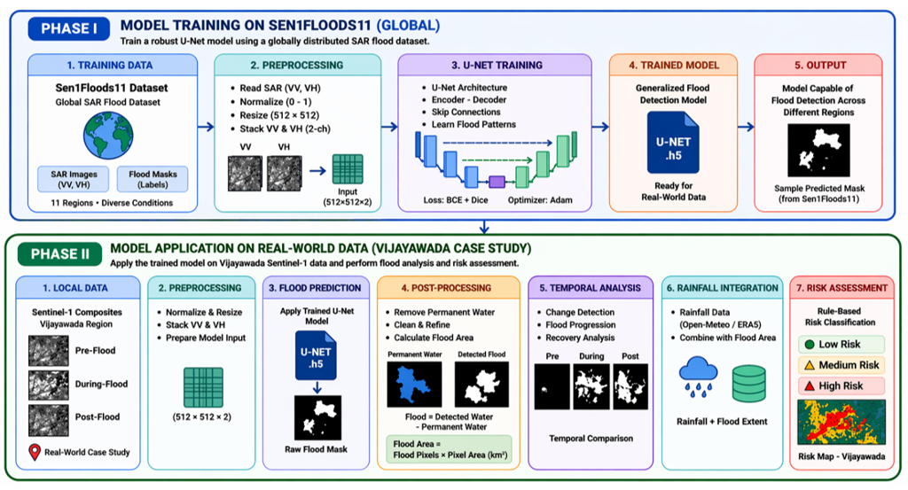
</p>

The proposed framework consists of two major phases.

**Phase I – Model Development**

- Acquire and preprocess the Sen1Floods11 dataset
- Train the U-Net semantic segmentation model
- Evaluate model performance using standard segmentation metrics

**Phase II – Real-world Flood Monitoring**

- Acquire Sentinel-1 SAR imagery using Google Earth Engine
- Apply the trained U-Net model
- Remove permanent water bodies
- Estimate flood extent
- Integrate rainfall information
- Generate locality-wise flood risk assessment

---

## Repository Structure

```text
Flood-Monitoring-and-Prediction-Using-Satellite-Data/
│
├── README.md
├── LICENSE
├── CHANGELOG.md
├── CONTRIBUTING.md
├── CODE_OF_CONDUCT.md
├── SECURITY.md
├── CITATION.cff
├── requirements.txt
├── .gitignore
├── .gitattributes
│
├── assets/
│   ├── banner.png
│   ├── README.md
│   └── images/
│       ├── workflow.png
│       ├── architecture.png
│       ├── unet_architecture.png
│       ├── dataset_samples.png
│       ├── preprocessing.png
│       ├── data_pipeline.png
│       ├── loss_curve.png
│       ├── metrics_curve.png
│       ├── confusion_matrix.png
│       ├── model_comparison.png
│       ├── prediction_examples.png
│       ├── flood_area.png
│       ├── flood_pixels.png
│       ├── rainfall.png
│       ├── risk_heatmap.png
│       └── interactive_map.png
│
├── docs/
│   ├── architecture.md
│   ├── dataset.md
│   ├── preprocessing.md
│   ├── training.md
│   ├── inference.md
│   └── evaluation.md
│
├── notebook/
│   └── Flood_Monitoring_and_Prediction_Using_Satellite_Data.ipynb
│
├── model/
│   ├── README.md
│   └── flood_unet.keras
│
├── report/
│   └── Project_Report.pdf
│
├── sample_outputs/
│
└── src/
```

---

## Technology Stack

| Category | Technology |
|----------|------------|
| Programming Language | Python 3.10 |
| Deep Learning | TensorFlow, Keras |
| Model | U-Net |
| Dataset | Sen1Floods11 |
| Satellite Data | Sentinel-1 SAR |
| Remote Sensing | Google Earth Engine |
| GIS Processing | Rasterio |
| Image Processing | OpenCV, Scikit-Image |
| Data Augmentation | Albumentations |
| Data Analysis | NumPy, Pandas |
| Visualization | Matplotlib, Folium |
| Development Platform | Google Colab |
| Weather Data | Open-Meteo API |

---

## Dataset

The project uses the **Sen1Floods11** dataset, a benchmark dataset designed for flood mapping using Sentinel-1 Synthetic Aperture Radar (SAR) imagery.

The dataset contains paired SAR images and pixel-wise flood masks, enabling supervised semantic segmentation for flood detection.

For real-world validation, Sentinel-1 SAR imagery of the **September 2024 Vijayawada flood event** was acquired through **Google Earth Engine**, while rainfall information was collected using the **Open-Meteo API**.

### Dataset Highlights

- Sentinel-1 SAR imagery
- VV and VH polarization bands
- Pixel-wise flood annotations
- Binary segmentation masks
- Multi-region flood events
- Public benchmark dataset

<p align="center">
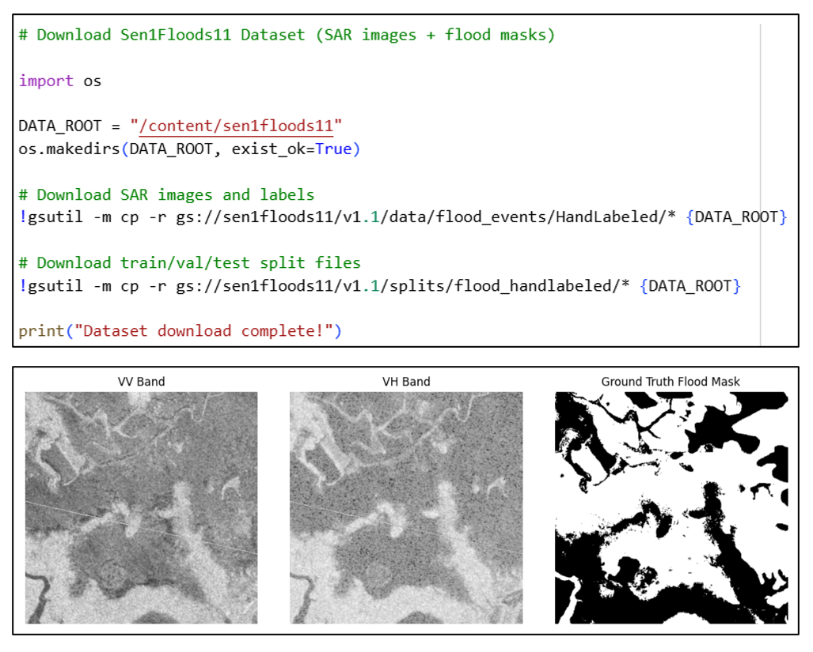
</p>

---

## Data Preprocessing

The preprocessing pipeline prepares Sentinel-1 SAR imagery for model training and inference.

Major preprocessing steps include:

- Reading VV and VH SAR bands
- Handling missing and invalid pixel values
- Normalization of SAR backscatter values
- Image resizing
- Binary flood mask generation
- Dataset splitting
- Data augmentation

<p align="center">
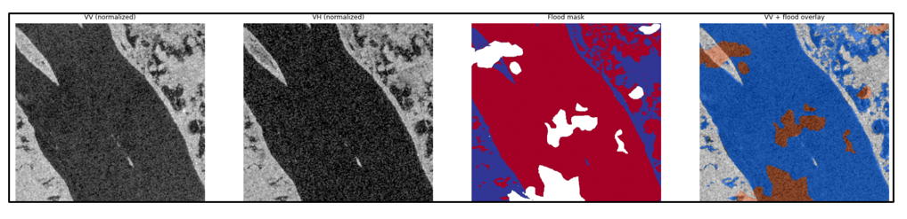
</p>

<p align="center">
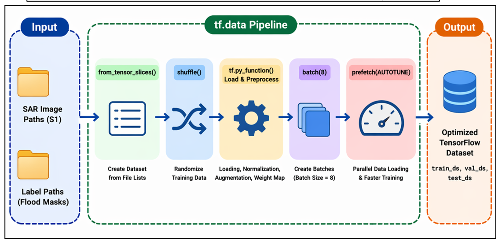
</p>

---

## Model Architecture

The proposed flood segmentation model is based on the **U-Net** architecture, a convolutional neural network specifically designed for semantic image segmentation.

The network consists of:

- Encoder path
- Bottleneck layer
- Decoder path
- Skip connections
- Batch normalization
- ReLU activation
- Sigmoid output layer

The model accepts two-channel Sentinel-1 SAR imagery (VV and VH) as input and produces a binary flood probability map.

<p align="center">
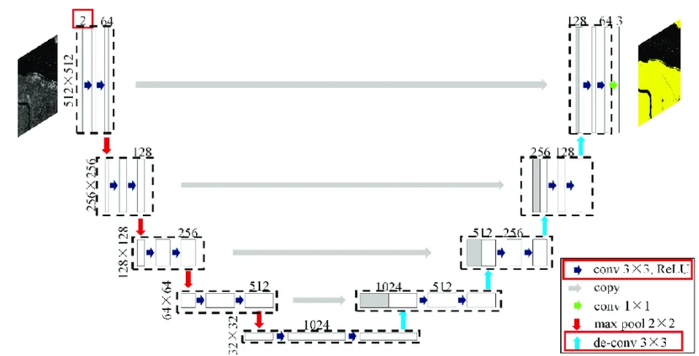
</p>

---

## System Architecture

The complete framework integrates remote sensing, deep learning, and rainfall analysis into a unified flood monitoring pipeline.

<p align="center">
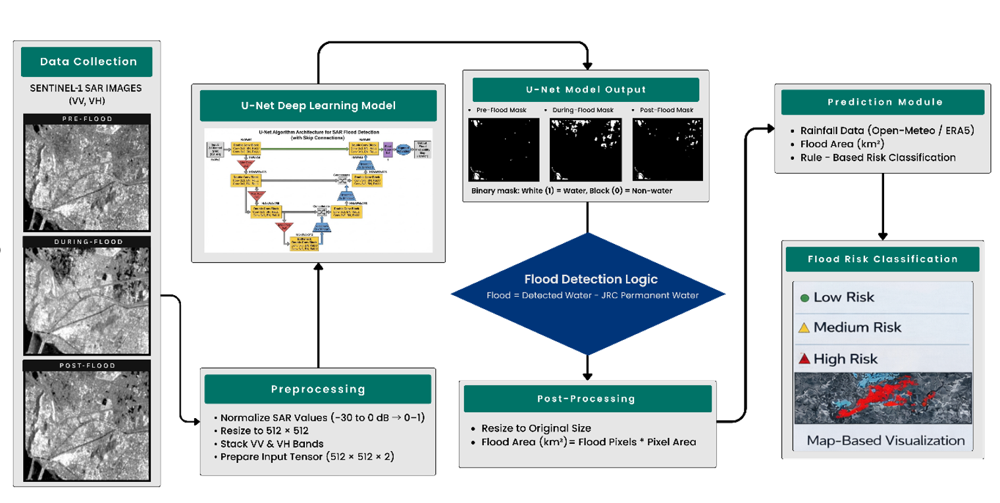
</p>

The system performs:

1. Sentinel-1 SAR acquisition
2. Google Earth Engine preprocessing
3. Deep learning-based flood segmentation
4. Permanent water removal
5. Flood area estimation
6. Rainfall analysis
7. Flood risk assessment
8. Interactive visualization

---

## Installation

### Prerequisites

- Python 3.10 or above
- Google Colab (Recommended)
- Google Earth Engine Account
- Git

### Clone the Repository

```bash
git clone https://github.com/<your-username>/Flood-Monitoring-and-Prediction-Using-Satellite-Data.git

cd Flood-Monitoring-and-Prediction-Using-Satellite-Data
```

### Install Dependencies

```bash
pip install -r requirements.txt
```

---

## Running the Project

This project was developed and tested using **Google Colab**.

Open the notebook:

```text
notebook/Flood_Monitoring_and_Prediction_Using_Satellite_Data.ipynb
```

Execute the notebook sequentially.

The workflow performs:

1. Import required libraries
2. Authenticate Google Earth Engine
3. Prepare the dataset
4. Preprocess Sentinel-1 SAR imagery
5. Train or load the U-Net model
6. Generate flood predictions
7. Remove permanent water
8. Estimate flood extent
9. Integrate rainfall data
10. Generate flood risk maps

---

## Training

The U-Net model is trained using the Sen1Floods11 dataset.

Training configuration:

| Parameter | Value |
|-----------|-------|
| Model | U-Net |
| Framework | TensorFlow / Keras |
| Loss Function | Binary Cross-Entropy + Dice Loss |
| Optimizer | Adam |
| Input Size | 512 × 512 |
| Output | Binary Flood Mask |

To train from scratch, execute all notebook cells in order.

The trained model can be saved using:

```python
model.save("model/flood_unet.keras")
```

---

## Inference

For inference using a trained model:

```python
from tensorflow.keras.models import load_model

model = load_model("model/flood_unet.keras")
```

The model accepts Sentinel-1 VV and VH SAR imagery and produces a binary flood segmentation mask.

Outputs include:

- Flood probability map
- Binary flood mask
- Flood extent estimation
- Flood risk assessment
- Visualization maps

---

## Results

The proposed framework was evaluated on the **Sen1Floods11** benchmark dataset and further validated using Sentinel-1 SAR imagery from the **September 2024 Vijayawada flood event**.

### Performance Metrics

| Metric | Score |
|---------|------:|
| Precision | **0.8358** |
| Recall | **0.7327** |
| Dice Score | **0.7808** |
| IoU | **0.6405** |
| Accuracy | **0.9486** |
| Specificity | **0.9794** |

---

### Training Performance

<p align="center">
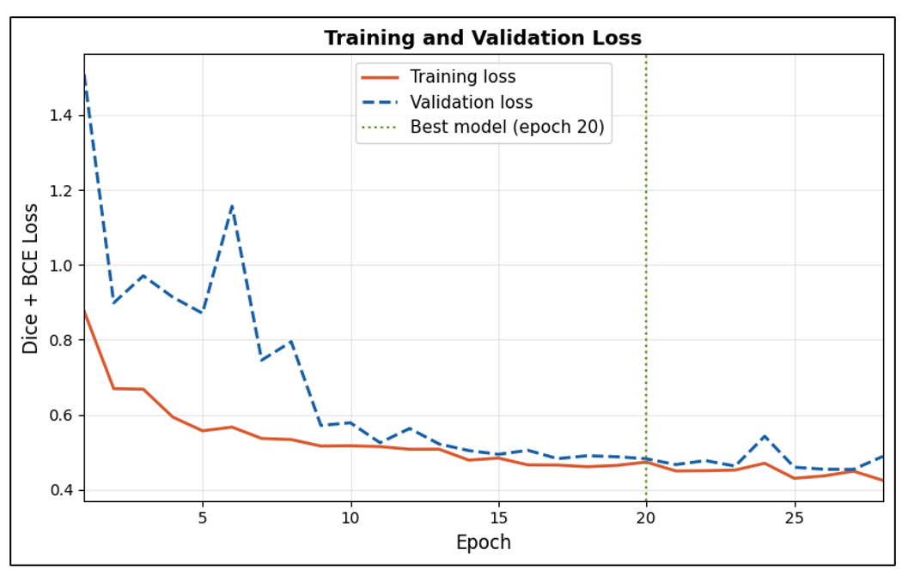
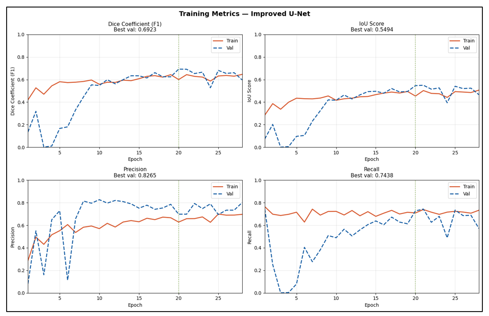
</p>

The training curves demonstrate stable convergence of the U-Net model, with both the training and validation losses decreasing consistently while segmentation metrics improve over successive epochs.

---

### Model Evaluation

<p align="center">
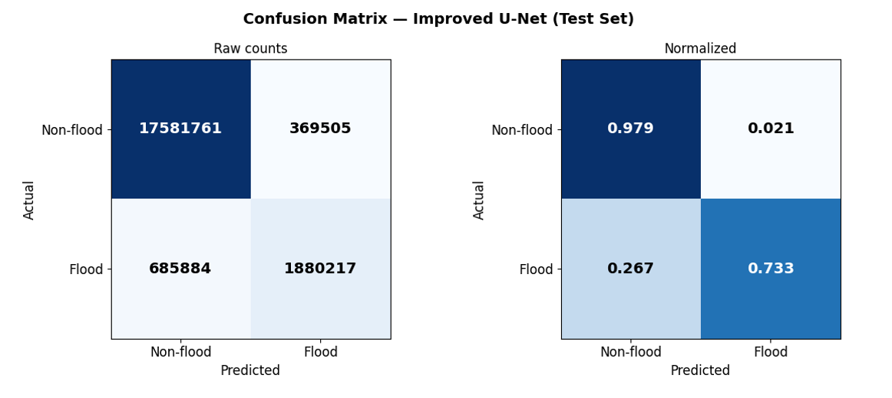
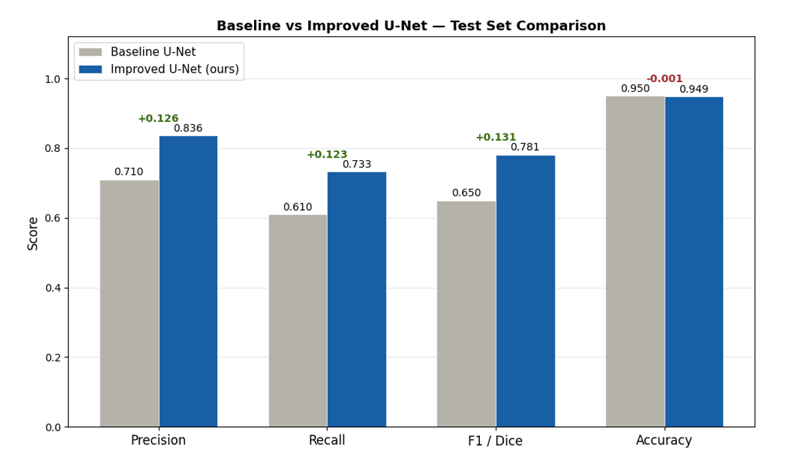
</p>

The evaluation results indicate that the proposed U-Net model effectively distinguishes flooded and non-flooded regions while achieving competitive segmentation performance on the Sen1Floods11 benchmark.

---

### Flood Prediction Examples

<p align="center">
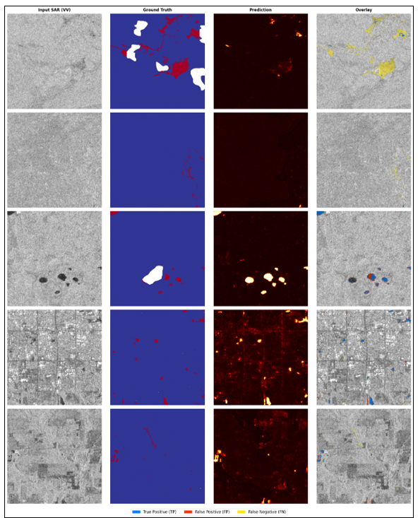
</p>

The figure above illustrates representative flood segmentation results, comparing Sentinel-1 SAR inputs, ground-truth masks, predicted probability maps, and overlay visualizations.

---

### Flood Monitoring Analysis

<p align="center">
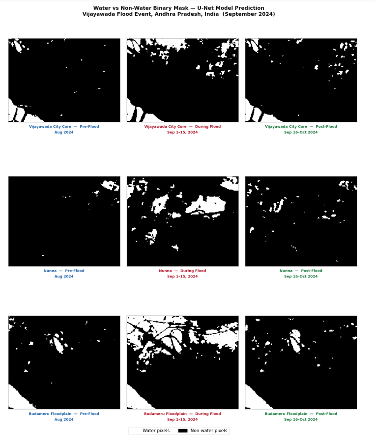
</p>

Binary flood masks generated by the trained model enable visualization of flood progression across multiple locations and observation periods.

---

### Flood Area Estimation

<p align="center">
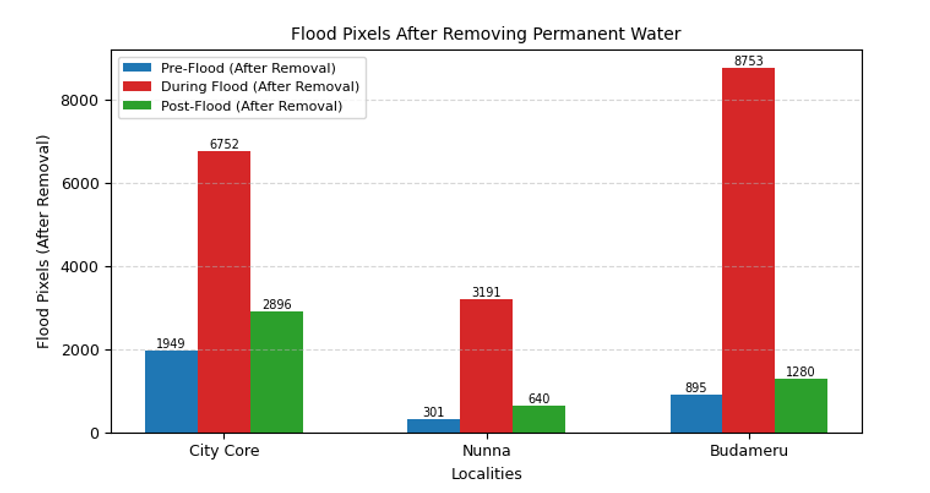
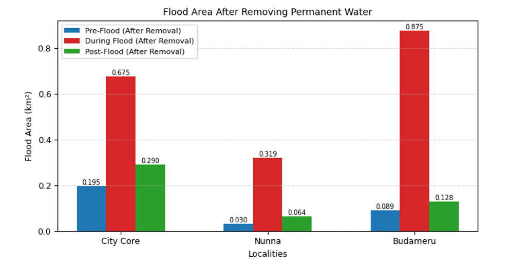
</p>

Flood extent is quantified using the predicted segmentation masks after removing permanent water bodies, allowing comparison of inundated regions across different time periods.

---

### Rainfall and Risk Assessment

<p align="center">
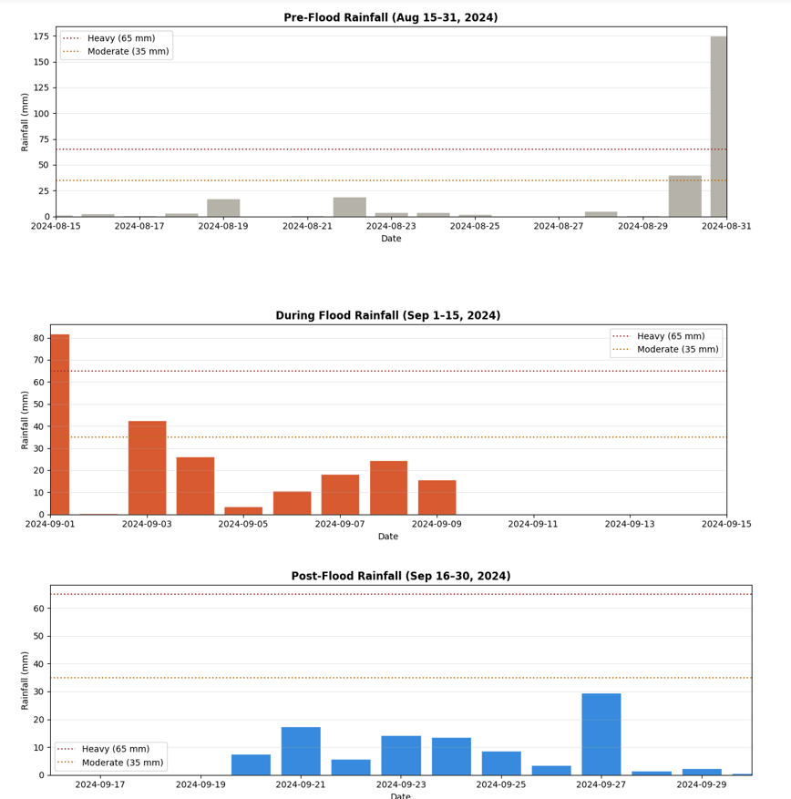
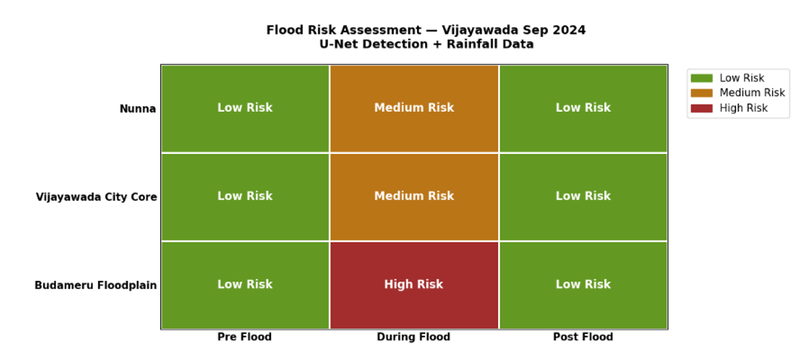
</p>

Historical rainfall observations are integrated with flood extent analysis to estimate locality-wise flood severity and generate flood risk maps for disaster management.

---

### Interactive Flood Visualization

<p align="center">
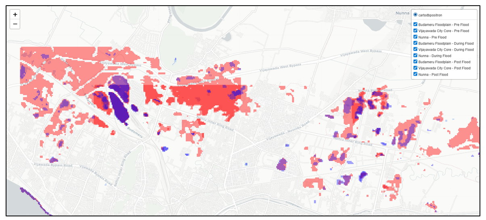
</p>

The final visualization combines predicted flood regions, rainfall information, and locality-wise analysis to support flood monitoring and emergency response.

---

## Future Work

Potential improvements to the framework include:

- Real-time flood monitoring using continuously updated Sentinel-1 imagery.
- Multi-temporal flood forecasting using sequential SAR observations.
- Integration of additional environmental datasets such as DEM, land cover, and river discharge.
- Exploration of transformer-based semantic segmentation models.
- Deployment as a web-based GIS dashboard.
- Mobile-based flood alert and notification system.

---

## Documentation

Additional documentation is available in the `docs/` directory.

| Document | Description |
|----------|-------------|
| architecture.md | Overall system architecture |
| dataset.md | Dataset information |
| preprocessing.md | Data preprocessing pipeline |
| training.md | Model training process |
| inference.md | Model inference workflow |
| evaluation.md | Evaluation methodology |

---

## References

- Sen1Floods11 Dataset
- Sentinel-1 Mission (European Space Agency)
- Google Earth Engine
- Open-Meteo API
- JRC Global Surface Water Dataset
- TensorFlow Documentation
- U-Net: Convolutional Networks for Biomedical Image Segmentation

---

## Citation

If you use this project in your research, please cite:

```bibtex
@misc{gurugubelli2026flood,
  author = {Gurugubelli Sathwik},
  title = {Flood Monitoring and Prediction Using Satellite Data using Remote Sensing and Machine Learning},
  year = {2026},
  publisher = {GitHub},
  url = {https://github.com/Sathwik-0906/Flood-Monitoring-and-Prediction-Using-Satellite-Data}
}
```

---

## Acknowledgements

This project was developed as part of the Bachelor of Technology program in Computer Science and Engineering at **GITAM (Deemed to be University), Visakhapatnam**.

The implementation makes use of:

- Sentinel-1 SAR Imagery
- Google Earth Engine
- Sen1Floods11 Dataset
- TensorFlow & Keras
- Open-Meteo API
- JRC Global Surface Water Dataset

Special thanks to the faculty members and mentors who provided guidance throughout the development of this project.

---

## License

This project is licensed under the **MIT License**.

See the `LICENSE` file for complete details.
